# Final Handout: DHBW Community Dashboard <!-- omit from toc --> 

- [project introduction](#project-introduction)
  - [the problem](#the-problem)
  - [the solution](#the-solution)
- [tech stack](#tech-stack)
- [architecture](#architecture)
  - [architecture decisions](#architecture-decisions)
  - [overview](#overview)
  - [component vs microservice](#component-vs-microservice)
- [quality assurance](#quality-assurance)
  - [test coverage](#test-coverage)
  - [monitoring](#monitoring)
- [CI/CD](#cicd)
- [statistics](#statistics)
- [project management](#project-management)
  - [scrum workflow](#scrum-workflow)
  - [project retro](#project-retro)
  - [risk management](#risk-management)
- [demo screenshots](#demo-screenshots)
  - [dashboard](#dashboard)
  - [log in](#log-in)
  - [settings](#settings)
  - [calendar](#calendar)
  - [canteen](#canteen)
- [cheers, capyclue.](#cheers-capyclue)
- [bonus: capygallery.](#bonus-capygallery)

## project introduction

### the problem

- no DHBW(-Karlsruhe) app for all platforms 
- many sources for trivial information
  - RAPLA
  - canteen
- cumbersome navigation of canteen website

### the solution

- intuitive dashboard app for every device
- single source of truth for DHBW students
- RAPLA calendar integration
- unified canteen menus
- adjustable to the user's liking
- lots of capybaras because capybara

Related:
- [Software Requirements Specification (SRS)](../software_requirements_specification/software_requirement_specification.md)
- [First Blog Post](https://capyclue.mush-it.com/?p=58)

---

## tech stack

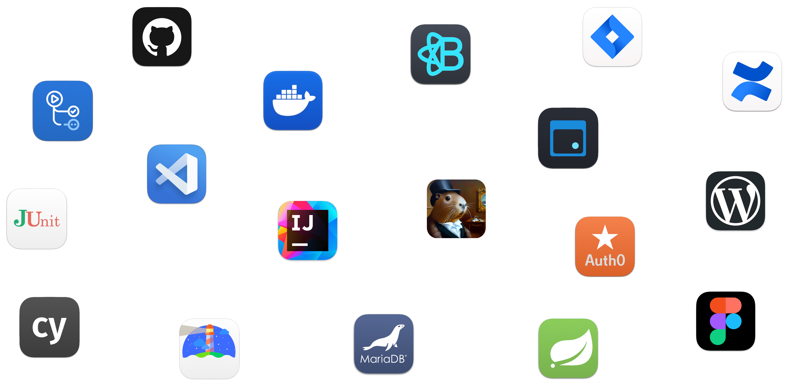

### documentation <!-- omit from toc --> 

- [**Jira:**](https://www.atlassian.com/software/jira) sprint planning, scrum board
- [**Confluence:**](https://www.atlassian.com/software/confluence) team internal documentation
- [**Worpress:**](https://capyclue.mush-it.com/) weekly blog posts
- [**Figma:**](https://www.figma.com/) wireframing, designing

### infrastructure <!-- omit from toc --> 

- [**VSCode:**](https://code.visualstudio.com/) frontend development
- [**IntelliJ:**](https://www.jetbrains.com/idea/) backend development
- [**Docker:**](https://www.docker.com/) containerization
- [**GitHub:**](https://github.com/clueless-capybaras/dhbw-community-dashboard/tree/main) repository, version control

### development <!-- omit from toc --> 

- [**React-Bootstrap:**](https://react-bootstrap.github.io/) frontend framework for React
- [**Auth0:**](https://auth0.com/) user authorization framework
- [**FullCalendar:**](https://fullcalendar.io/) calendar framework for React
- [**Spring Boot:**](https://spring.io/projects/spring-boot) microservice framework for Java
- [**MariaDB:**](https://mariadb.org/) MySQL based relational database

### testing and monitoring <!-- omit from toc --> 

- [**Actions:**](https://docs.github.com/en/actions) test automation
- [**JUnit:**](https://junit.org/junit5/) unit and integration tests
- [**cypress:**](https://www.cypress.io/) frontend e2e tests
- [**Lighthouse:**](https://developer.chrome.com/docs/lighthouse/) performance monitoring

---

## architecture

### architecture decisions

- availability
  - minimal downtime → single page application, microservices
  - usable with bad connection → single page application, minimal data concept
  - app should survive a crash → domain isolation to microservices

Related:
- [Architecture Significant Requirements (ASR)](../architecture_significant_requirements/architecture_decisions_and_design_patterns.md)
- [Utility Tree](../architecture_significant_requirements/utility_tree.md)
- [Software Architecture Document (SAD)](../software_architecture_document/software_architecture_document.md)
- [Blog Post: ASR](https://capyclue.mush-it.com/?p=182)
- [Blog Post: SAD](https://capyclue.mush-it.com/?p=254)

### overview

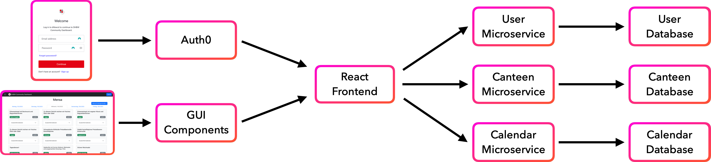

### component vs microservice

#### component <!-- omit from toc --> 
- reusable React elements
- atomic design
- Bootstrap framework
  - pre-configured components
  - customizable

#### microservice <!-- omit from toc --> 
- MVC in Java Spring Boot
  - entity: represent DB table
  - controller: intercept requests
  - service: business logic
  - repository: CRUD methods

---

## quality assurance

### test coverage

- **JUnit:** unit and integration tests for backend microservices
  - component coverage: **100**%
  - statement coverage: **70-80**%
- **cypress:** e2e tests for frontend workflows
  - coverage: **90-100**%

### monitoring

- first contentful paint: **< 1.8s**
- speed index: **< 3.4s**
- commulative layout shift: **< 0.1**

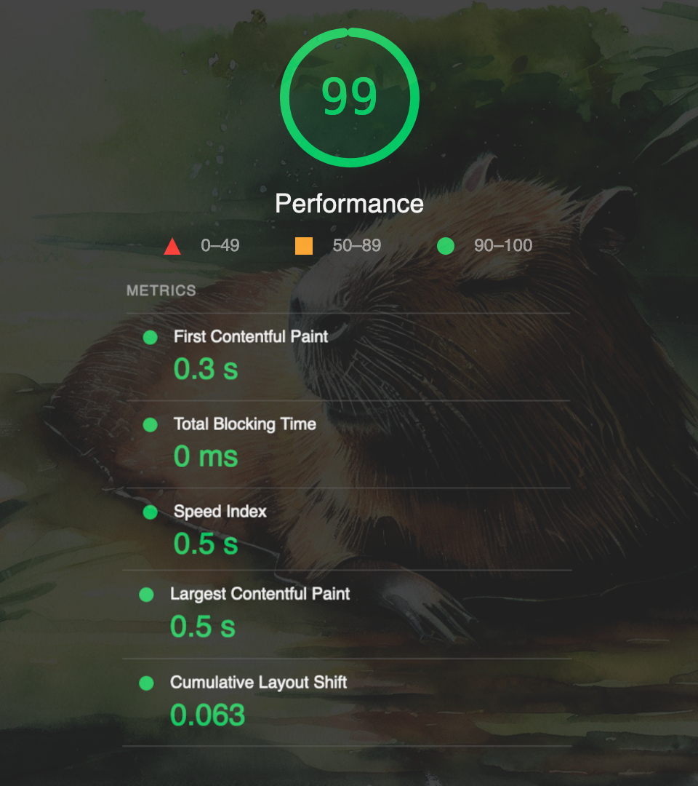

Related:
- [Test Plan](../test_plan/test_plan.md)
- [Test Evaluation Summary](../test_evaluation_summary/test_evaluation_summary.md)
- [Failed Tests](../test_evaluation_summary/failed_tests.md)
- [Blog Post: Test Plan](https://capyclue.mush-it.com/?p=296)
- [Blog Post: Metrics](https://capyclue.mush-it.com/?p=301)

---

## CI/CD

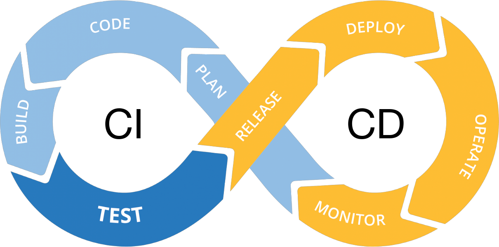

#### plan and code <!-- omit from toc --> 
- add tasks to Jira
- use GitHub integration for Jira
  - create branch related to ticket
- development process

#### build and test <!-- omit from toc --> 
- pipeline triggers on any push
  - maven and npm for building
  - runs all tests
  - works on any branch
- instant feedback

#### release and deploy <!-- omit from toc --> 
- merge into/push to main:
  - pipeline triggers tests again
  - deploys changes to server

#### operate and monitor <!-- omit from toc --> 
- monitor metrics via Lighthouse
  - focus on FCP, SI, CLS

Related:
- [Blog Post: CI/CD](https://capyclue.mush-it.com/?p=282)

---

## statistics

---

## project management

### scrum workflow

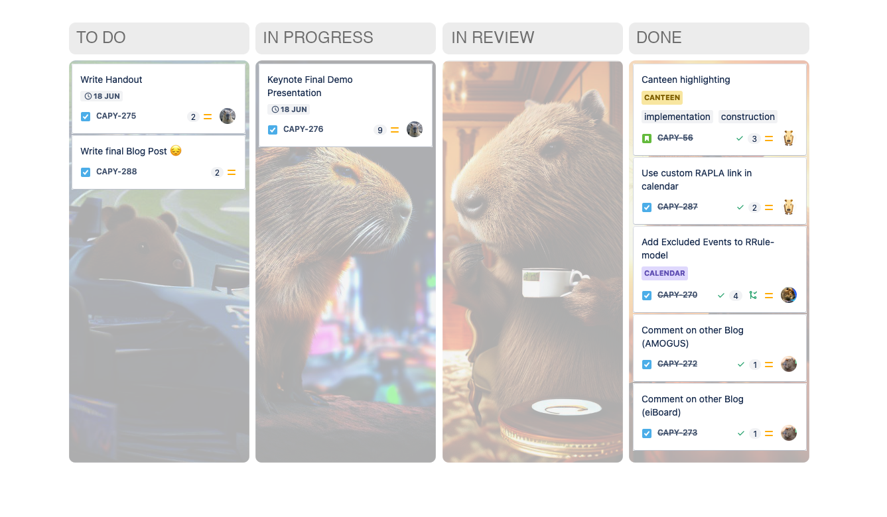

- weekly sprint planning meeting
  - retrospective
  - refinement
  - story point estimation
- do and review tasks flexibly and independently

### project retro

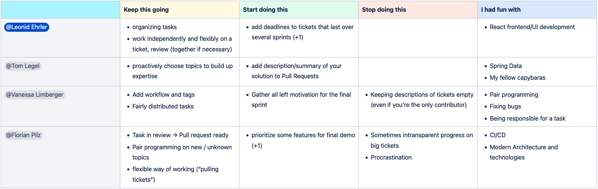

### risk management

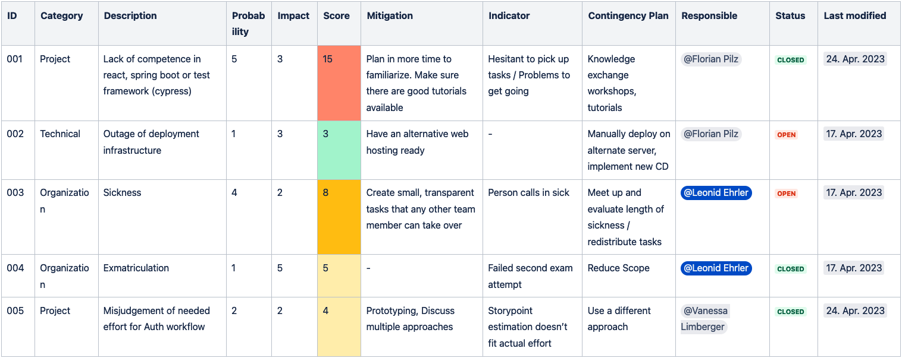

---

## demo screenshots

### dashboard

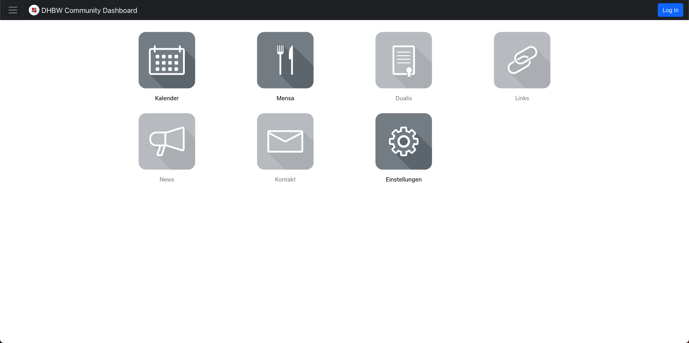

This is the landing page of our web application. You can use the dashboard to navigate to the different components. 

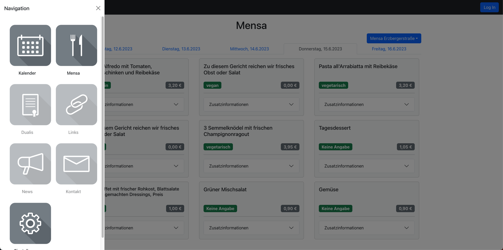

The top bar appears in every component and can be used to navigate back to the dashboard, open the sidebar for direct navigation to another component and log in to your account.

### log in

We externalized the log in feature to Auth0, a 3rd party authentification provider. To register an account, a `@student.dhbw-karlsruhe.de` email is required. 

We can access user data from Auth0 to save the user's settings to our user database. We do not persist full user data like email or password hashes but only the user-id.

### settings

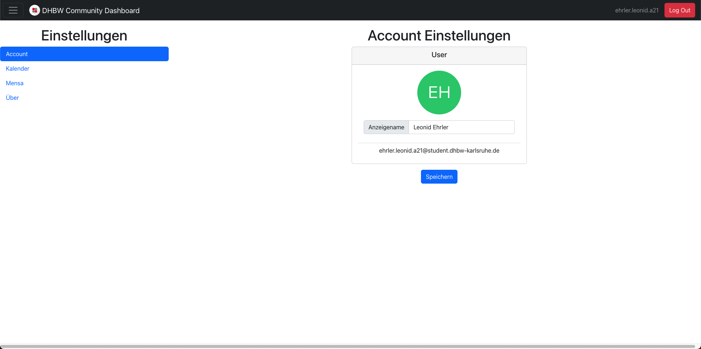

In this component, the user can change personal settings. For changes to their password, they will be redirected to Auth0. In addition, we provide the option to change settings of the calendar and canteen components for better customization.

### calendar

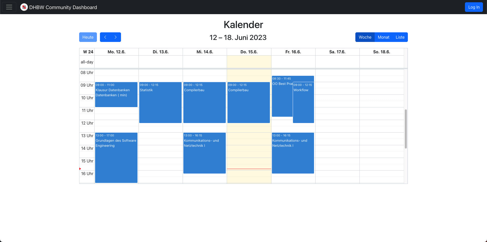

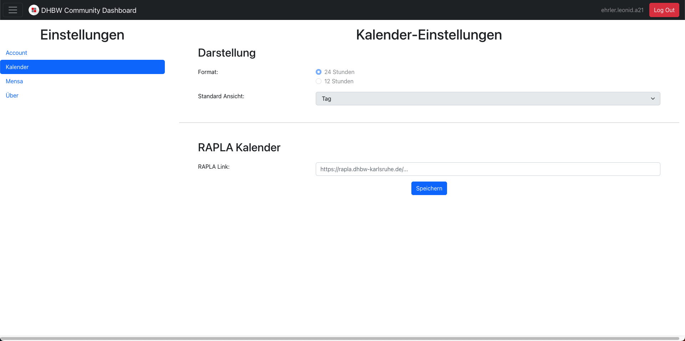

The calendar component is based on the FullCalendar framework for JavaScript (optimized for React). After inserting a RAPLA link in the calendar settings, the whole lecture schedule can be displayed in various formats (list/week/month).

### canteen

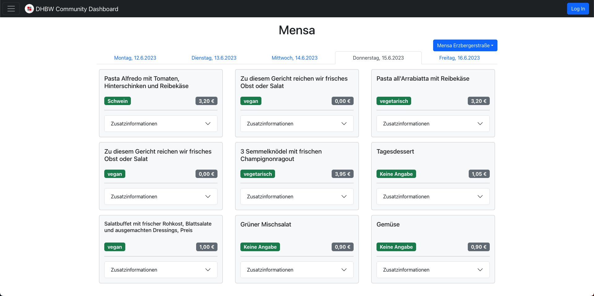

The canteen component features three different canteens, including the DHBW canteen. Every meal is displayed as a card component that includes information about the name, price, type (vegan/vegetarian/pork) and allergenes. 

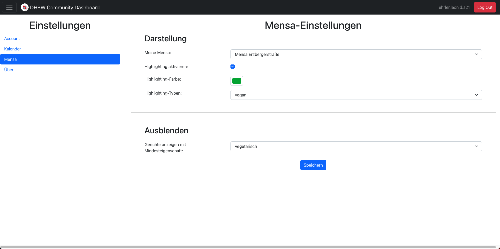

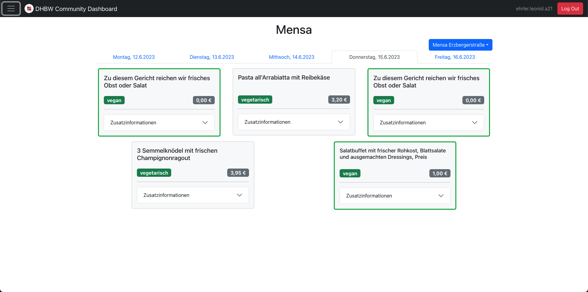

By changing the settings, meals can be hidden or highlighted. The user can choose the category and the highlighting color.

---

## cheers, capyclue.

It was our pleasure to deliver a great demo of our vision: DHBW Community Dashboard. We hope that you enjoyed our weeky updates and you like our demo app. It was great to work on this project for the last months. And maybe, one day when your favorite capybaras aren't clueless anymore, the DHBWCD is not a demo anymore?!

Thanks to all the blog-readers, feedback-givers, project-observers and capybara-enjoyers, you are the best!

Cheers, capyclue.

---

## bonus: capygallery.

Have a look at our precious AI generated capybaras. We used Bing Image Generator (DALL-E).

### supercapy <!-- omit from toc --> 

### happybara <!-- omit from toc --> 

### crucader-capy <!-- omit from toc --> 

### capy be sippin <!-- omit from toc --> 

### capyzara <!-- omit from toc --> 

### squattybara <!-- omit from toc --> 

### sunnybara <!-- omit from toc --> 

### sunnybara but watercolor <!-- omit from toc --> 

### layered capy <!-- omit from toc --> 

### sleek capy <!-- omit from toc --> 
