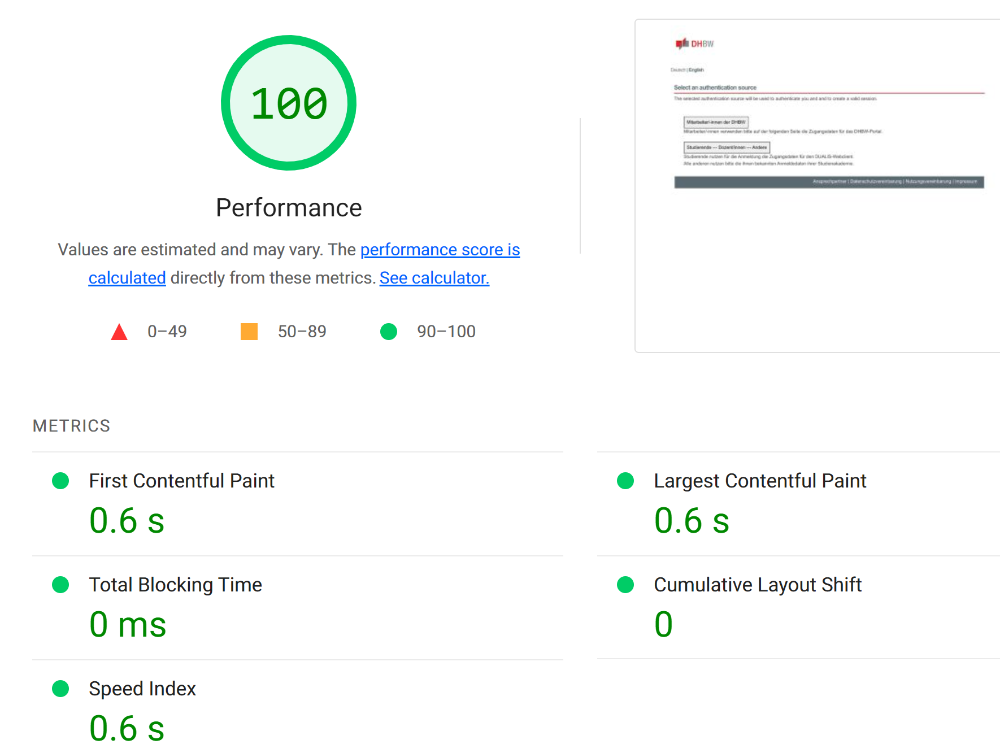
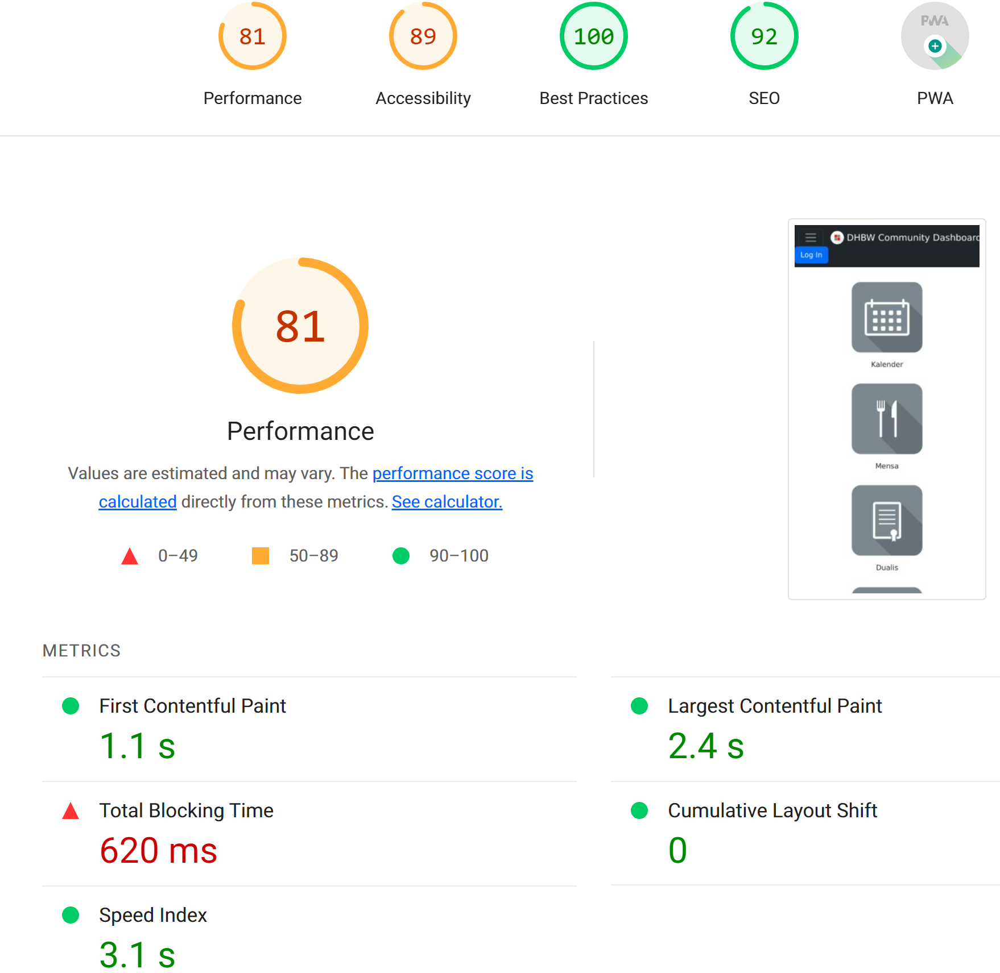

# Test Evaluation Summary

- [Test Evaluation Summary](#test-evaluation-summary)
- [Introduction](#introduction)
  - [Purpose](#purpose)
  - [Document Terminology and Acronyms](#document-terminology-and-acronyms)
- [Test Strategy](#test-strategy)
- [Test Plan](#test-plan)
- [Test Cases](#test-cases)
- [Test Results](#test-results)
- [Metrics](#metrics)
- [Recommendations](#recommendations)
- [Conclusion](#conclusion)

# Introduction

## Purpose
This document aims to give an overview of the tests that have been planned for the DHBW Community Dashboard and, in more detail, disclose all performed tests, their results and related metrics. Moreover, it shall be a dynamic document which will be extended whenever there are new tests.

## Document Terminology and Acronyms
| Abbrevation | Meaning                                                                                                               |
| ----------- | --------------------------------------------------------------------------------------------------------------------- |
| DHBW        | [Duale Hochschule Baden-Württemberg](https://www.dhbw.de/startseite) (Baden-Württemberg Cooperative State University) |
| e2e         | End-to-End                                                                                                            |

# Test Strategy
In short, our plan is to use Cypress for e2e-Testing. This affects every major frontend functionality which includes Calendar, Canteen and Settings, but not Log In/Sign In because this is an externalized feature. With JUnit we run Unit and particularly Integration tests for backend components. Since our frontend and backend are deeply connected, it is complicated to make clear separations between units. Therefore, we mainly perform integration tests. For automation, we include all tests in a GitHub Actions pipeline that triggers on every push to a branch.

For more information, please also read our full [Test Plan](../test_plan/test_plan.md) and our [CI/CD Setup Summary](../../docs/ci_cd/ci_cd_setup_summary.md).

# Test Plan
This section outlines the specific testing tasks, timelines, and resources required to achieve the testing objectives. Please have a look at our extra file for the [Test Plan](../test_plan/test_plan.md).

# Test Cases
This section links to the specific test cases that were executed, including their pass/fail status. Further navigation inside Github allows for further details including a view on the specific component/test suite/feature failing. 

Currently we mainly have written Cypress Tests and for JUnit Tests we wrote Smoke Tests. Unfortunately we are not up to date with our JUnit Tests but we already have the framework implemented and besides written tests we also did a review every time we made a pull request. This way another developer could check the code and test it manually, so our Software was still extensively tested.

You can have a detailed look on our performed tests in our 
[Test History](https://github.com/clueless-capybaras/dhbw-community-dashboard/actions/workflows/tests.yml). There you can click on a specific test you want to have a detailed look on and you can see the test results and the artifacts.

# Test Results
This section summarizes the results of the testing, including any defects found, their severity, and the steps taken to resolve them. 

You can find a automatically written detailed list of all failed tests in our [Failed Tests Table](failed_tests.md).

# Metrics
This section provides quantitative data on the testing process, such as the number of defects found, the defect resolution time, and the test coverage achieved. As we've used Lighthouse for this, we can provide a detailed report of the metrics for each push to the main branch. You can find the history with the artifacts [here](https://github.com/clueless-capybaras/dhbw-community-dashboard/actions/workflows/lighthouse.yml).

# Recommendations
This section offers suggestions for improving the testing process and the quality of the software. 

One section where we could still improve is the amount of written JUnit Tests, but as already written above, we have implemented the framework and it's also included in our GitHub Actions so there are only more tests missing.

# Conclusion
This section summarizes the key findings of the testing and the overall status of the software quality.

The overall status of our Software is bug free. We have a very high test coverage in our frontend and we are confident that our Software is ready for production.

Our Lighthouse metrics for desktop nearly have a 100% score and since we focused on the desktop version, we are very satisfied with this result.

The mobile version is not as good as the desktop version with a score of 81%. This is because we didn't focus on the mobile version and we didn't have enough time to optimize it. But we are still satisfied with the result because it is still an okay score.

You can have a more detailed view for every run of the Lighthouse Tests within the linked artifacts [here](https://github.com/clueless-capybaras/dhbw-community-dashboard/actions/workflows/lighthouse.yml).