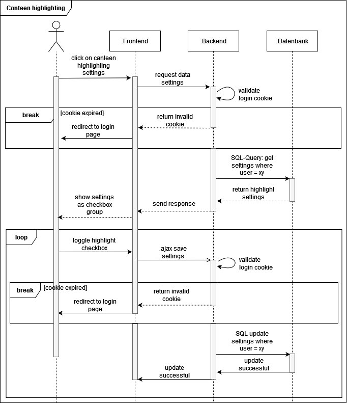

# Use-Case-Realization Specification: Canteen highlighting

# 1. Introduction

## 1.1 Brief Description
This Use-Case-Realization Specification (UCRS) describes how the canteen highlighting of our PWA will work. 
Therefore we include an overview about this functionality and a sequence diagram for visualization.

## 1.2 Definitions, Acronyms, and Abbreviations
| Abbreviation | Description |
|--------------|-------------|
| UCRS         | Use-Case-Realization Specification|
| PWA          | Progressive Web-App|

## 1.3 References
[Canteen highlighting sequence diagram](../sequence_diagrams/SD1_Canteen_Highlighting.png)

# 2. Flow of Events

## 2.1 Basic Flow
In the following diagram the workflow of the canteen highlighting is visualized.

- First a user wants to configure the settings for highlighting. 
- If the in the backend checked login cookie is invalid, the action will be interrupted and the user needs to login again. 
- If the cookie is valid the backend will fetch the saved settings from the database and the frontend will show current settings on the screen. 
- When the user changes its current settings the changes will be saved in the database, after another check whether the login cookie is still valid.
- The changing-funtion is a loop so with every click the change is directly saved and therefore no saving-button is needed.

### Sequence Diagram

