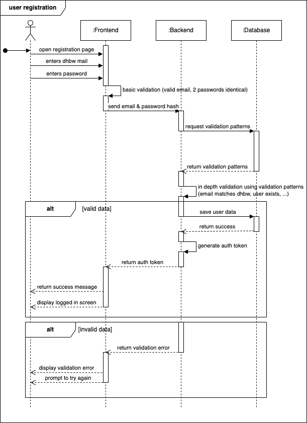

# Use-Case-Realization Specification: User Registration

# 1. Introduction

## 1.1 Brief Description
This use-case-realization specification describes the flow of new user registrations using the registration frontend page. Main constraints for this are that the new user provides a valid DHBW mail address and comes up with a secure password, which they have to repeat to prevent typos. This will be pattern matched. Passwords will be hashed in the front end and therefore never sent via the internet.

## 1.2 Definitions, Acronyms, and Abbreviations
| Abbreviation | Description                        |
|--------------|------------------------------------|
| DHBW         | Duale Hochschule Baden-Württemberg |

## 1.3 References
- [User Registration Sequence Diagram](../sequence_diagrams/SD2_User_Registration.png)

# 2. Flow of Events

## 2.1 Basic Flow
- A new user navigates to the registration page of the frontend.
- The user is faced with a registration form and enters a (valid DHBW) email address and 2x a new password.
- Frontend pattern matching is used to check if the email is a generally valid email address and the password have sufficient complexity as well as if they are identical.
- The password is hasehd and the email address and a password hash are sent to the back end.
- The backend retrieves additional validation criteria and patterns from the database (e.g. the valid DHBW email schemas or if the user already exists, ...)
- The backend applies these validation criteria.
- On success the user data is stored to the database for future log in attempts and a session auth token (jwt) is handed back to the frontend which redirects the user to the logged-in sections of the application.
- On failure a validation error (with sufficient clarity but adhereing to modern security guidelines) is handed back to the frontend and displayed to the user. Eventually they may try again.

### Sequence Diagram

